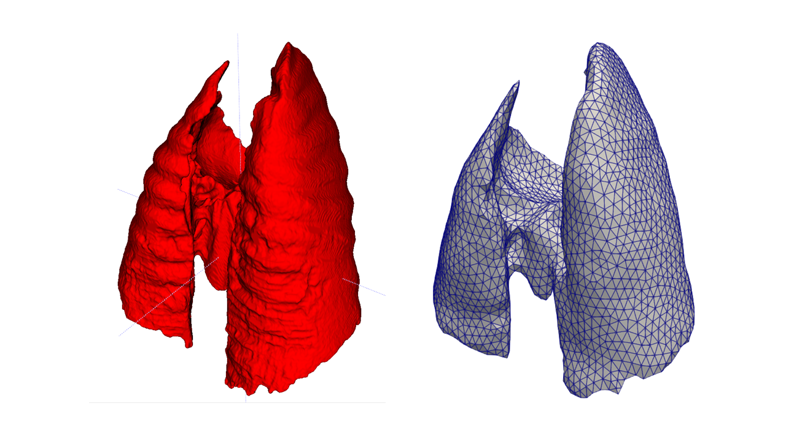

# Meshing a lung 
A guide to transform a binary segmentation into a FEniCS-admisible tetrahedral mesh

## Software and libraries in use

* Matlab 2023a
    * Iso2Mesh 1.9.6 
* MeshLab 2022.02
* Python 3.10
    * Numpy (1.24.3)
    * Nibabel (5.1.0)
    * Scikit-image (0.19.3)
    * Meshio (5.3.4)
    * FEniCS (a.k.a. dolfin)

NOTE: This doesn’t mean you must use only these versions of the software and libraries discussed herein. But it is good to know that this combination of packages got the work done. It may be helpful if you are stuck with some links in the chain not working correctly.

## Disclaimer

The following pipeline creates tetrahedral meshes from binary segmentations. Even though this could be done uniquely in Python, the results using such an approach have not been adequate. This is the current best approach to generate meshes that will be used in `FEniCS`.

## Meshing process
Generating a tetrahedral mesh from a binary segmentation incurs in the following processes:
 * Binary segmentation smoothing
 * Surface mesh generation
 * Surface mesh smoothing and remeshing
 * Tetrahedral meshing
 * Post-processing
 
### Binary segmentation smoothing

The initial input for the algorithm is a binary lung segmentation, namely `RAW_Mask_Exp.nii.gz`. It is binary as it is composed of ones and zeros. Some automatic segmentation software offers lobar segmentation in which each lung’s lobes are denoted with a different integer number. Other approaches use an additional integer to indicate the airways to declare inlets and outlets for the airflow. In this case, we only require a single lung segmentation, which can be done in [ITK-SNAP](http://www.itksnap.org/pmwiki/pmwiki.php) or a U-Net implementation specialized in lungs, such as [JoHof's implementation](https://github.com/JoHof/lungmask).

The smallest length-scale of the features within the segmentation strongly affect the final mesh quality. Small features require a small element size to be captured, and it is frequent to see that a coarse segmentation produces a mesh with multiple defects, such as missing elements. It is convenient to apply some morphology operations, such as dilation, erosion, and Gaussian smoothing, to obtain smooth surfaces that are easy to mesh. This can be done in Matlab, Python, or any other language, as they are standard techniques in image processing.

The code `segmentation_smoother.py` provides an example of a simple smoothing scheme that can help find an optimal configuration for a given segmentation. 

The output of this section is another segmentation, namely `NEW_Mask_Exp.nii.gz`

### Surface mesh generation

A surface mesh is composed of *nodes* and an *element table*. The nodes are a collection of three-dimensional points distributed along the lung’s surface. The element table is a data structure whose elements are the IDs of the nodes that compose every triangle on the surface.

Plenty of software can perform this task, most of them based on [CGAL](https://www.cgal.org/), a well-established C++ computational geometry library. Even though it is a powerful and flexible software, it is troublesome to install, and its usage requires understanding the C++ syntax, CMake, and other complicated software and computational standards that may be challenging for a non-experienced user. A more user-friendly option is the library [iso2mesh](https://iso2mesh.sourceforge.net/cgi-bin/index.cgi) in [MATLAB](https://www.mathworks.com/products/matlab.html).

MATLAB is a scientific software whose licenses can be obtained through the academic institution one belongs to. An alternative to Matlab is Octave, an open-source language analog to MATLAB in which the same code should be able to run, but probably at a different speed. A fresh install of MATLAB will likely require linking the library *iso2mesh* to the software, a procedure that might be solved by searching in Google.

The code `matlab_meshing_pipeline.m` is a script that must be adapted to the user's requirements. It is divided into:
* Data importation: The path to the mesh must be specified so it can be read into.
* Surface mesh generation: The routine `vol2surf` is employed to generate a triangular mesh.
* Surface mesh repair: The triangular mesh is examined for common errors such as repeated or isolated nodes, a consistent surface orientation and the such. This is performed through multiple calls to the function `meshcheckrepair`.
* Mesh exportation: In order to continue the processing, the mesh must be exported to another 
format. It is convenient to use the `*.off` format, which is a standard for triangular meshes.

It is important to note that the smoothing process is performed elsewhere, even though MATLAB contains smoothing operations. The *Laplacian Smoothing* is an algorithm frequently used in these instances. It has the inconveniency that it reduces the mesh's volume by pushing the points on the surface inwards. This is particularly inconvenient for the some of the lung geometries as some sections may be already thin and troublesome to mesh, a further reduction of the volume will result in difficulties in the following steps. An alternative approach is the usage of the software [MeshLab](https://www.meshlab.net/).

The input of this block is a binary segmentation such as `NEW_Mask_Exp.nii.gz`, and the output is a surface mesh such as `coarsesurfmesh.off`.

Please note that the meshing process in *iso2mesh* only uses the data within the nifti file and not its spatial references. The produced mesh should be transformed using the spatial data in the image’s affine matrix. It is often enough to multiply the nodes by the three first elements in the diagonal of the affine matrix, respectively, according to the transformed coordinate.

### Surface mesh smoothing and remeshing

According to the website for [MeshLab](https://www.meshlab.net/):
> MeshLab. The open source system for processing and editing 3D triangular meshes.
It provides a set of tools for editing, cleaning, healing, inspecting, rendering, texturing and converting meshes. It offers features for processing raw data produced by 3D digitization tools/devices and for preparing models for 3D printing.

In particular, we will be interested in two operations, the *Taubin Smoothing* and the *Isotropic Explicit Remeshing*. The first one is a smoothing operation that preserves volume, which is as good as it gets. The second one reduces some artifacts where some regions on the mesh are triangulated using a very small length scale for the element.

A common sequence would be:
* Taubin Smooth
* Isotropic Explkicit Remeshing [Uncheck *Refine step* and Check *Adaptative remeshing*]
* Taubin Smooth

After applying these operations, export mesh in the `*.off` format. For instance,  `smoothsurfmesh.off`.

### Tetrahedral meshing

Load the `*.off` mesh in MATLAB and apply the function `surf2mesh` from the package *iso2mesh*. You will obtain a new set of *points* and a new *connectivity table*.  You may also be interested in conserving the array *faces* that hold the surface mesh.

Export the mesh in `*.mat` format, which can be read in Python using the `scipy.io.loadmat` function. Remember that numbering in MATLAB starts with 1 while in Python starts with 0. So make sure to compensate for that in your connectivity table.

You can always examine the mesh quality using the function `meshquality` included in *iso2mesh*. It is a good idea to create a histogram and see how well (or how bad) is your current mesh. Plenty of factors affect the final outcome, from the mesh size (`opt=7` is the default parameter in the sample code for the function `vol2surf`) to the sequence of morphology operations applied to the initial binary image. Getting a good mesh is a mixture of craftsmanship and sheer luck. The set of tools discussed here may make this task easier.

Having reached this point, you may wonder, what do I do now?

### Post-processing
 
The ultimate goal of this guide is not only to create a tetrahedral mesh from a binary image but to make it compatible with *FEniCS*. This Python package allows us to solve differential equations in discretized domains. But this software, as any other, is picky about its permitted inputs.

The routine `Matlab-to-FEniCS-bridge.py` reads a `*.mat` file and generates the necessary inputs that are required for the *ards-lung-simulator* that comprises this project. It is a complex code whose discussion will be pending until the pipeline for the simulator is stable. 

