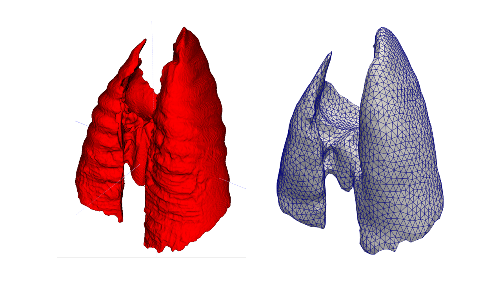

# Meshing a Lung: From Binary Segmentation to FEniCS Mesh

This directory provides the pipeline to transform 3D binary lung segmentations (NIfTI format) into FEniCS-admissible tetrahedral meshes with anatomical boundary tags and initial end-expiratory porosity distributions.

## Overview of Meshing Scripts

The meshing workflow is organized into sequential steps:

1. **`1_initial_meshing.py` (Step 1: Volumetric Mesh Generation)**:
   * Loads the smoothed binary lung mask (`.nii.gz`).
   * Leverages Iso2Mesh (`cgalv2m` / `v2m`) to produce initial tetrahedral surface and volume elements.
   * Computes element volumes and scales coordinates according to image affine transforms.

2. **`2_extrabc_info.py` (Step 2: Boundary Region Extraction & Identification)**:
   * Extracts external surface triangle facets from the tetrahedral volume mesh.
   * Classifies boundary regions into specific anatomical surfaces:
     * Pleural surface (costal and mediastinal borders)
     * Diaphragmatic boundary surface
     * Airway tree terminal boundary patches / inlet faces
   * Computes face normals, centroids, and bounding boxes for spatial region tagging.

3. **`3_final_meshing_wbc.py` (Step 3: FEniCS Boundary Marking & Assembly)**:
   * Combines volume connectivity with boundary surface markers (`boundary_markers`).
   * Tags boundary surfaces with integer IDs for FEniCS facet measures (`ds(1)`, `ds(2)`, etc.).
   * Projects reference/unloaded end-expiratory porosity distributions onto tetrahedral cells.
   * Exports FEniCS-compatible XML / HDF5 / XDMF mesh formats and ParaView visual verification files (`Omega.pvd`, `boundary_markers.pvd`).

4. **`evaluate_meshes.py` (Mesh Quality Verification)**:
   * Evaluates minimum/maximum element volumes, aspect ratios, dihedral angles, and Jacobian determinants.
   * Detects degenerate, inverted, or poorly conditioned tetrahedra before running finite element simulations.

---

## Required Dependencies

* **Python 3.9+**: `numpy`, `scipy`, `nibabel`, `meshio`, `pyvista`, `trimesh`, `iso2mesh`
* **MeshLab / Iso2Mesh**: For optional surface remeshing, Taubin smoothing, and isotropic repair.
